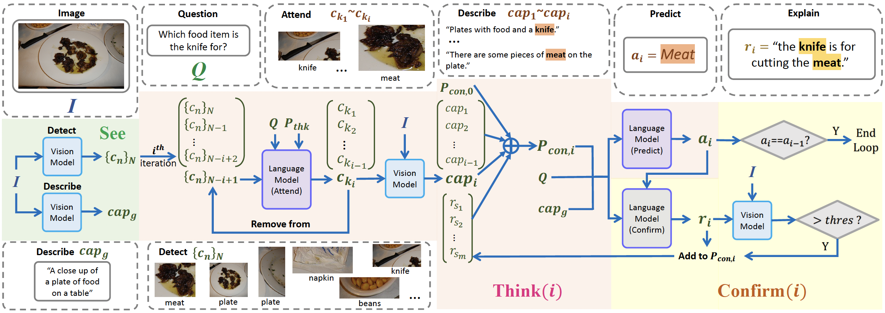

# VisualCoT Refactor (See–Think–Confirm)

Quickstart:

1. Create env
   - Conda: `conda env create -f environment.yml && conda activate visualcot`
   - Pip: `python -m venv .venv && .venv/Scripts/activate && pip install -r requirements.txt`
2. Prepare data: See `scripts/download_data.sh` and place datasets under `data/raw/`
3. Run preprocess (placeholder): `python -m src.cli.preprocess --config configs/experiments/aokvqa_baseline.yaml`
4. Evaluate (when ready): `python -m src.cli.evaluate --config configs/experiments/aokvqa_baseline.yaml`

See `docs/` for architecture and reproduction details.
Code for [paper](https://arxiv.org/abs/2301.05226) *Visual Chain-of-Thought Prompting for Knowledge-based Visual Reasoning*
## Overall framework


## Preprocess datasets
* Coco dataset 2014 and 2017
* Download OK-VQA and AOK-VQA dataset, following the [PICa](https://github.com/microsoft/PICa) format
* For A-OKVQA, run preprocess script (`preprocess/preprocess_aokvqa.sh` for AOK-VQA). For OK-VQA, you need to modify the script a little to fit its format (A-OKVQA and OK-VQA have similar formats).
* Make training object similarity file (`object_similarity/object_similarity_aokvqa.sh` for AOK-VQA and `object_similarity/object_similarity_okvqa.sh` for OK-VQA)
## Prepare Scene graph and captions
* Before running experiments, VisualCoT also need scene graph and captions, including three files for each input image (under `input_text/scene_graph_text/scene_graph_coco17`, `input_text/scene_graph_text/scene_graph_coco17_attr`, and `input_text/scene_graph_text/scene_graph_coco17_caption`). We have provided an example of image No.57 under each dir. Please follow the format of the examples and get scene graphs for all other images.
* If you do not want to inference a scene graph model to get the scene graphs, here we provide the scene graphs and captions we generated (need additional process to match the format of above three examples):
  * [Dense Captions](https://umass-my.sharepoint.com/:u:/g/personal/qinhongzhou_umass_edu/ETTHSIaFZt1AnxyZjGDfAhEBIxn1CKM8JIle6rRjFHlLaQ?e=05Bt7N).
  * [Attributes](https://umass-my.sharepoint.com/:u:/g/personal/qinhongzhou_umass_edu/EZh2wLg5CrNIku4nWew40QgB6hwbJiD6jBy5oAxXVYA0zQ?e=TISTYq) for COCO17 test dataset.
  * [Relations and Objects](https://umass-my.sharepoint.com/:u:/g/personal/qinhongzhou_umass_edu/ETf9rj1yrFFJmEkJFGvvCBEBQ1uDz3b6LTSafigANyZcBg?e=15rBIw) for COCO17 test dataset.
  * [Attributes](https://umass-my.sharepoint.com/:u:/g/personal/qinhongzhou_umass_edu/EYNsQp_JD5ZGqmImfz3AWTgBQ3NCPIP9GOGASzLpEXIATQ?e=TD2ToA) for COCO17
  * [Relations and Objects](https://umass-my.sharepoint.com/:u:/g/personal/qinhongzhou_umass_edu/ESSSDHfvXEFMrggmJeuExlEBgCmJar5Ibt17z8yY9ZFgdw?e=cfEisT) for COCO17
## Run experiments
* `run_aokvqa.sh` for AOK-VQA
* `run_okvqa.sh` for OK-VQA
## Main Results
| Backbone    | OK-VQA test (DA) | AOK-VQA val (DA) | AOK-VQA test (DA) |
|-------------|------------------|------------------|-------------------|
| OPT-66B     | 44.6             | 46.4             | 46.0              |
| Llama-2-70B | 54.9             | 50.5             | 54.4              |
## Cite
arXiv version
```
@article{chen2023see,
  title={Visual Chain-of-Thought Prompting for Knowledge-based Visual Reasoning},
  author={Chen, Zhenfang and Zhou, Qinhong and Shen, Yikang and Hong, Yining and Sun, Zhiqing and Gutfreund, Dan and Gan, Chuang},
  journal={arXiv preprint arXiv:2301.05226},
  year={2023}
}
```


python -m src.vctp.data.preprocess.object_similarity.cli `
    --dataset aokvqa `
    --split train `
    --sg_path "./data/processed/input_text/scene_graph_text" `
    --annotations_dir "./data/raw/aokvqa_annotations" `
    --output_path "./data/processed/object_similarity/train_object_select_aokvqa_answer.pkl" `
    --metric answer `
    --device cuda

python src/vctp/data/preprocess/make_clip_features.py `
    --questions data/raw/aokvqa_annotations/aokvqa_v1p0_train_from_hf.json `
    --images data/raw/aokvqa_images/ `
    --qfeatures data/processed/coco_clip_new/coco_clip_vitb16_train2017_aokvqa_question.npy `
    --ifeatures data/processed/coco_clip_new/coco_clip_vitb16_train2017_aokvqa_convertedidx_image.npy

python src/cli/run_aokvqa_pipeline.py --config configs/experiments/aokvqa_baseline.yaml --limit 1